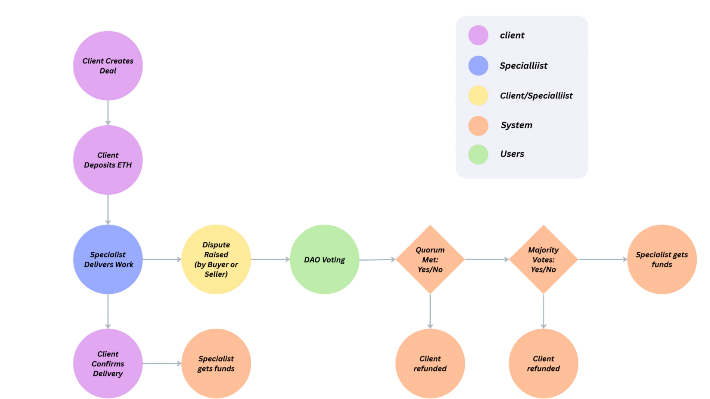
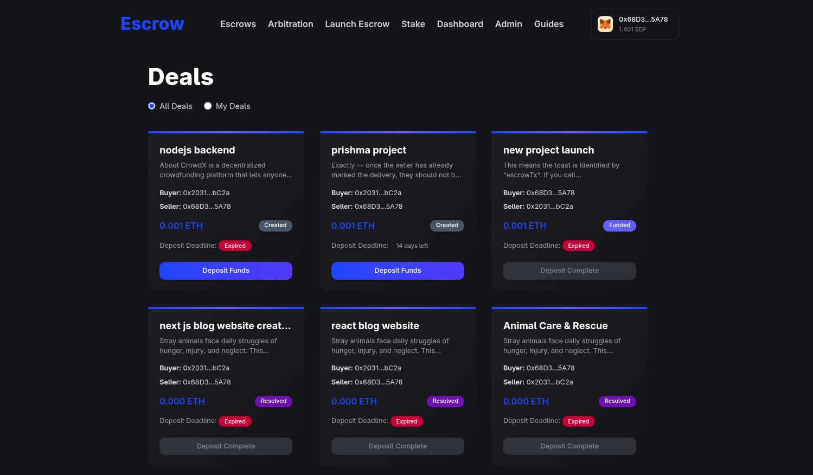
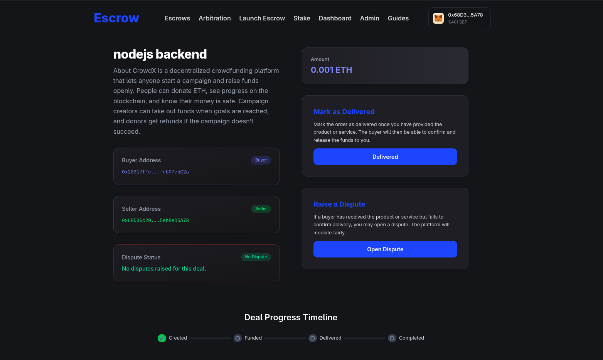
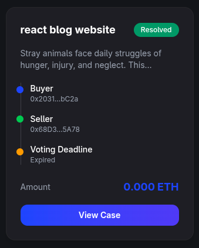
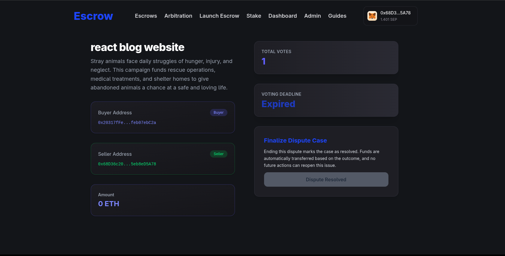
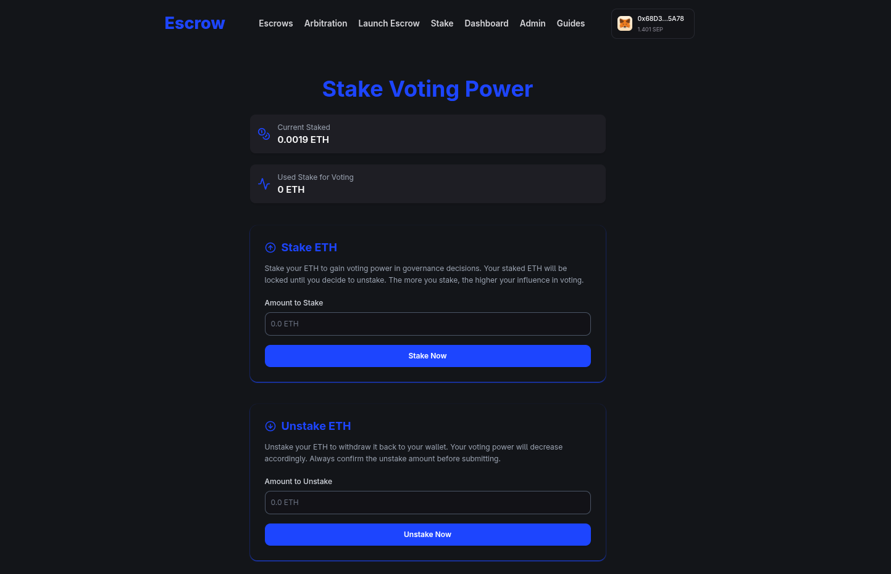
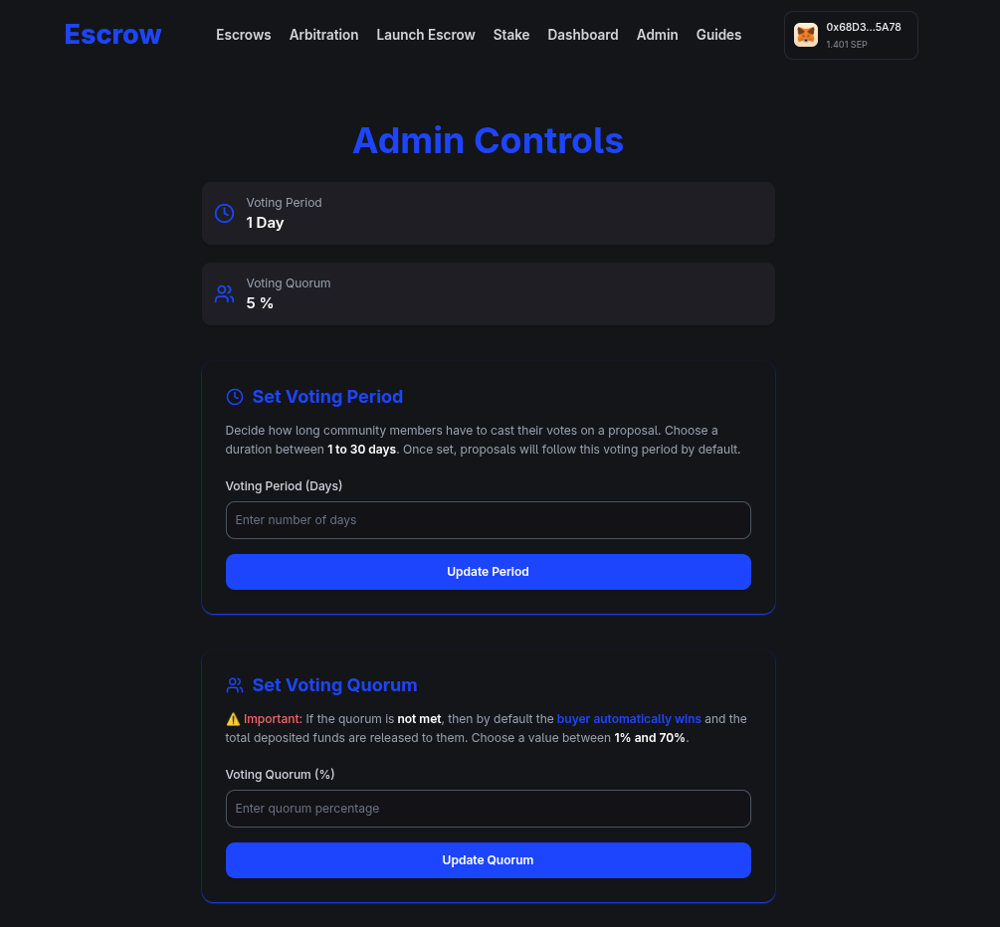

 <h1 align="center"> Escryn</h1>

Welcome to **Escryn** - a trustless deals platform where users can stake ETH for voting power, create/participate in deals, deposit funds into escrow, confirm delivery, and open/resolve disputes via DAO-governed voting.


---

## Table of Contents

1. [Deal Flow (User-facing)](#deal-flow-user-facing)
2. [Explore Active Deals](#explore-active-deals)
3. [Securely Deposit Funds](#securely-deposit-funds)
4. [View Disputes](#view-disputes)
5. [Participate in DAO Voting](#participate-in-dao-voting)
6. [Stake ETH](#stake-eth)
7. [My Deals](#my-deals)
8. [My Votes](#my-votes)
9. [My Stake History](#my-stake-history)
10. [Admin Controls](#admin-controls)
11. [Tech Stack](#tech-stack)

---

<br>

## Deal Flow (User-facing)

<br>

<p align="center">
        
</p>

---

<br>

## Explore Active Deals

Explore all active deals [**here**](https://escryn.vercel.app/deals) and effortlessly manage your personal Escryn agreements securely on the Escryn.

### Key Points
- **Browse Deals:** View every currently active agreement on the network.
- **Manage Agreements:** Track, edit, and manage your own Escryn deals from a single page.
- **Secure Platform:** All interactions are protected by smart-contract escrow for trustless transactions.

<br>

<p align="center">
<a href='https://escryn.vercel.app/deals'>
        
</a>
</p>

---


## Securely Deposit Funds

Securely deposit your funds into **Escryn**, wait for the specialist to deliver the product or service, confirm receipt once satisfied, and open a dispute if any issue arises.

### Key Points
- **Deposit Funds:** Lock your payment in a trustless escrow managed by Escryn smart contracts.
- **Delivery Confirmation:** Release funds only after you confirm successful delivery of the product or service.
- **Dispute Option:** If any issue occurs, you can initiate a dispute to involve DAO voting and resolution.

<br>

<p align="center">
        
</p>

---


## View Disputes

Explore all open and closed disputes [**here**](https://escryn.vercel.app/arbitration), track the progress of each case, and review outcomes to stay informed about the status of every transaction.

### Key Points
- **Open & Closed Cases:** Browse every dispute currently active or already resolved.
- **Progress Tracking:** Follow real-time updates on each case’s timeline and decisions.
- **Outcome Review:** Review final rulings to understand how each transaction was resolved.


<br>

<p align="center">
<a href='https://escryn.vercel.app/arbitration'>
        
</a>
</p>

---


## Participate in DAO Voting

Participate in the DAO and cast your vote for the client or specialist, assigning a specific weight to your decision.

### Key Points
- **Stake to Vote:** Stake ETH to gain voting power within the DAO.
- **Weighted Voting:** Your voting weight corresponds to the amount of ETH staked or other governance rules.
- **Fair Resolution:** Help decide dispute outcomes transparently and on-chain.


<br>

<p align="center">
        
</p>

---


## Stake ETH

Stake your ETH [**here**](https://escryn.vercel.app/stake) to gain voting power, participate in decision-making, support the client or specialist, help shape dispute outcomes, and unstake your ETH directly from the Escryn platform.

### Key Points
- **Gain Voting Power:** Staking ETH grants you governance rights to vote on dispute resolutions.
- **Support Decisions:** Influence outcomes by supporting either the client or specialist.
- **Unstake Anytime:** After dispute resolution or lock period, you can safely unstake your ETH from the same interface.


<br>

<p align="center">
<a href='https://escryn.vercel.app/stake'>
        
</a>
</p>

---


## My Deals

View all your deals [**here**](https://escryn.vercel.app/dashboard) including those you’ve created in the past and those currently active.  
Track every stage of each transaction with detailed status updates to stay informed on progress.

---

## My Votes

View all the votes you’ve cast on specific disputes [**here**](https://escryn.vercel.app/dashboard).  
Once a dispute is resolved, you can unlock your staked funds directly from the Escryn platform.

---

## My Stake History

View your complete stake and unstake history [**here**](https://escryn.vercel.app/dashboard).  
Track every transaction, monitor your ETH movements, and stay informed about your participation across the platform.


---


## Admin Controls

Administrators have the ability to configure key governance and fee parameters across the platform:

- **Voting Period:** Adjust the number of dispute voting days to set how long participants can cast votes.  
- **Quorum Threshold:** Modify the minimum participation required for a vote to be valid.  
- **Platform Fee:** Change the platform fee percentage applied to deals, ensuring flexible and transparent fee management.


<br>

<p align="center">
<a href='https://escryn.vercel.app/admin'>
        
</a>
</p>

---


## Tech Stack

* Smart contracts: **Solidity**
* Development: **Hardhat**
* Blockchain client: **ethers.js**
* Frontend: **Next.js** + **React**
* Styling: **Tailwind CSS**
* Testing: **Hardhat (Mocha/Chai)**

---

## Quickstart (Dev)


**Install**

```bash
# from project root
npm install
# or
# yarn install
```

**Run local node & contracts**

```bash
# Run Hardhat node
npx hardhat node

# Deploy locally (example)
npx hardhat run --network localhost scripts/deploy.js
```

**Run frontend**

```bash
# from /web or /frontend
npm run dev
# open http://localhost:3000
```

---


## ✨ Created By

**Smit Bhuva**  
 Web3 Developer | Solidity | Full Stack Developer  

- GitHub: [Smitbhuva15](https://github.com/Smitbhuva15)  
- LinkedIn: [Smit Bhuva](https://www.linkedin.com/in/smit-bhuva-1007ba314/)  
- 📧 Email: bhuvasmit1507@gmail.com  
